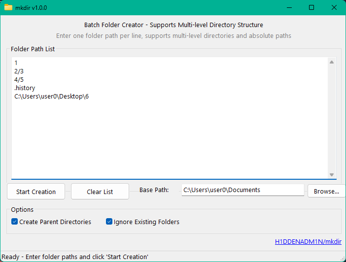
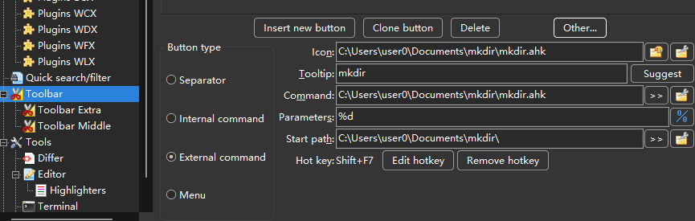

# Batch Folder Creation Tool

A powerful and user-friendly AutoHotkey v2.0 application for creating multiple folders and complex directory structures in batch mode.



## Features

### 🚀 Core Functionality
- **Batch Folder Creation**: Create multiple folders at once from a list
- **Multi-level Directory Support**: Supports complex nested directory structures
- **Absolute & Relative Paths**: Handles both absolute paths and relative paths with base directory
- **Smart Path Validation**: Validates path legality and prevents illegal characters

### ⚙️ Advanced Options
- **Parent Directory Creation**: Automatically create parent directories when needed
- **Duplicate Handling**: Option to ignore existing folders or report errors
- **Cross-Platform Path Support**: Handles both Windows (`\`) and Unix (`/`) path separators
- **Path Normalization**: Automatically normalizes and cleans up path formats

### 🛡️ Security & Permissions
- **Administrator Elevation**: Automatic UAC elevation for protected directories
- **Permission Detection**: Smart detection of permission issues
- **Safe Path Validation**: Prevents creation of system-reserved names and illegal paths

### 🎯 User Experience
- **Progress Tracking**: Real-time progress display during batch operations
- **Detailed Results**: Comprehensive success/failure reporting
- **Hotkey Support**: Keyboard shortcuts for efficient operation
- **Status Updates**: Live status bar updates throughout the process

## Installation

### Prerequisites
- **AutoHotkey v2.0+** - [Download here](https://www.autohotkey.com/download/)

### Method 1: Run Source Code
1. Download `mkdir.ahk`
2. Right-click → "Run Script" (requires AutoHotkey installed)

### Method 2: Compile to EXE
1. Install AutoHotkey v2.0
2. Right-click `mkdir.ahk` → "Compile Script"
3. Run the generated `mkdir.exe`

## Usage

### Basic Usage
1. **Enter Folder Paths**: Add one folder path per line in the text area
2. **Set Base Path**: Choose the base directory for relative paths
3. **Configure Options**:
   - ☑️ Create Parent Directories (recommended)
   - ☑️ Ignore Existing Folders
4. **Click "Start Creation"** or press `Shift+Enter`

### Command Line Support
```bash
# Start with specific working directory
mkdir.exe "C:\MyProjects"
```

#### Work with Double Commander

Double Commander is a popular file manager for Windows that supports batch operations.

Cerate External command with the Parameters `%d` .
Sugguested to set Hot key `Shift+F7` .



## Hotkeys

| Hotkey         | Action                   |
| -------------- | ------------------------ |
| `Shift+Enter`  | Start folder creation    |
| `Alt+Enter`    | Start folder creation    |
| `Ctrl+Shift+F` | Focus on path edit field |
| `Escape`       | Exit application         |

## Path Validation Rules

The tool ensures all paths comply with Windows naming conventions:

### ✅ Allowed
- Alphanumeric characters, spaces, hyphens, underscores
- Mixed path separators (`\` and `/`)
- Nested directory structures
- Absolute and relative paths

### ❌ Restricted
- Illegal characters: `< > " | ? * :`
- Reserved names: `CON, PRN, AUX, NUL, COM1-9, LPT1-9...`
- Trailing dots or spaces
- Empty path components

## Error Handling

### Common Issues & Solutions

| Issue                    | Solution                                     |
| ------------------------ | -------------------------------------------- |
| **Access Denied**        | Tool will prompt for administrator elevation |
| **Path Already Exists**  | Enable "Ignore Existing Folders" option      |
| **Invalid Characters**   | Tool will highlight the problematic line     |
| **Parent Doesn't Exist** | Enable "Create Parent Directories" option    |
| **Drive Not Ready**      | Check removable drives are accessible        |

### Administrator Mode
- Automatic detection of permission issues
- One-click UAC elevation
- Preserves all settings and paths during elevation
- Clear indication of administrator mode operation